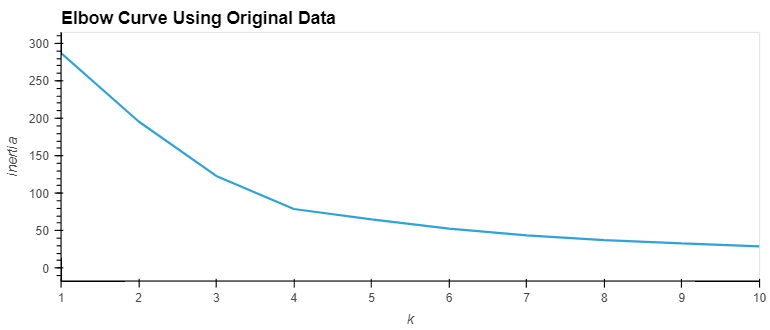
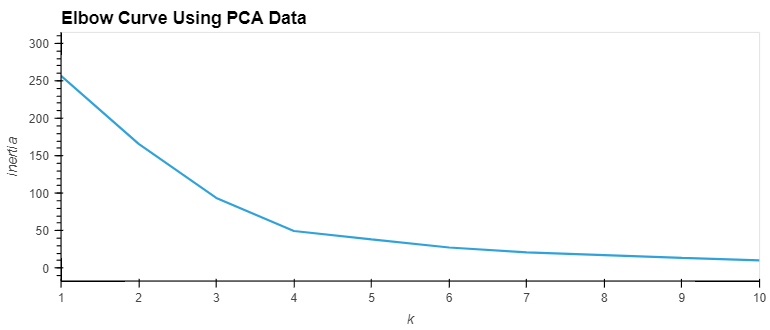
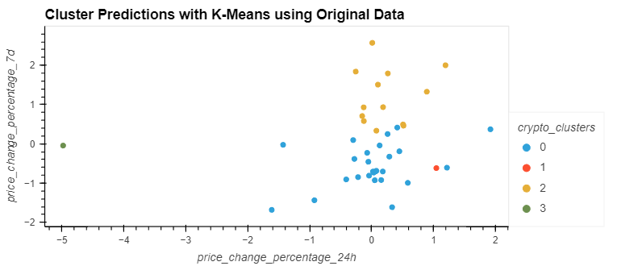
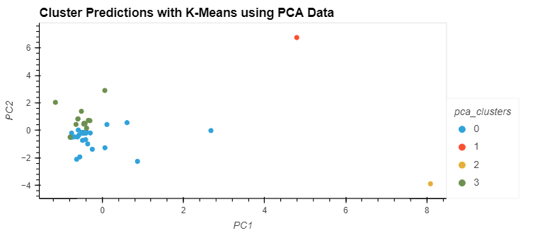

# Module 19 Challenge: CryptoClustering
<ins>Project Overview</ins>
-----

This project predicts if cryptocurrencies are affected by 24-hour or 7-day price changes. Overall, I discovered that the best value for k was the same either with the original scaled data or the PCA data. Despite this similarity, the K-Means clusters were different for each data set as the fewer features that were used to cluster the data shows tighter clusters and inertia with a steeper curve.

<ins>Processes and Technologies</ins>
-----

This project mainly utilizes Python and unsupervised learning to predict and plot the results. I used the `StandardScaler()` module from `scikit-learn` to normalize the data from the CSV file, then used the K-means model to cluster the cryptocurrencies using the original scaled dafaframe. Next, I performed a PCA to reduce the features to three principal components and found the best calue for k using the PCA data. I found that the value for k is 4 with the original scaled data as well as the PCA data.

**Elbow Curve Composite**

**K-Means Clustering Composite**

<ins>Challenges</ins>
-----

I didn't run into any major challenges working on this project and if you follow my pseudocode, you should be able to replicate this project on your own.
